# HA RAG Bridge

This project syncs Home Assistant metadata into ArangoDB and provides a simple FastAPI service.

## Quick Start

```bash
git clone <repo>
cp .env.sample .env
docker compose up -d
```
The container automatically bootstraps the database on start. Make sure your
ArangoDB instance runs with the `--experimental-vector-index` flag enabled so
vector search works correctly.

### Requirements

- ArangoDB 3.11 or newer
- python-arango 8.x
- Rust toolchain for building pydantic-core

## Dev container

Run `make dev-up` to launch Home Assistant, the bridge with hot reload and a local ArangoDB instance. VS Code can attach to the running bridge via the **Attach Bridge** debug configuration. Stop all services with `make dev-down`.

## Bootstrap CLI

After installing via Poetry or pulling the Docker image you can run the
bootstrap process directly:

```bash
docker run --rm ghcr.io/…/ha-rag-bridge:latest ha-rag-bootstrap --dry-run
```

Flags:

- `--dry-run` – only analyse and do not modify the database
- `--force` – drop and recreate indexes on dimension mismatch
- `--reindex [collection]` – rebuild vector indexes (all when omitted)
- `--quiet` – suppress info messages
- `--skip-invalid` – skip collections with illegal names
- `--rename-invalid` – attempt to auto-fix illegal names

Breaking change in v12.4: the internal collection `_meta` was renamed to `meta`.
Existing installations are migrated automatically during bootstrap.
Breaking internal: JS-API calls were replaced with Python client usage. Upgrading to v12.5 no longer requires the `arangosh` binary.
Persistent index creation now relies solely on python-arango; no JavaScript fallbacks remain.

```python
from ha_rag_bridge.db import BridgeDB
db = BridgeDB(...)
db.ensure_col("events")
mgr = IndexManager(db.collection("events"))
mgr.ensure_vector("embedding", dimensions=1536)
```

### Collection naming rules & auto-fix flags

Collection names must start with a letter and may contain letters, digits,
hyphen or underscore up to 255 characters. Names beginning with `arango` are
reserved. When the bootstrap encounters an invalid name you can either skip it
with `--skip-invalid` or automatically rename it using:

| Rule | Example |
|------|--------|
| Must not start with `_` | `_foo` → invalid |
| Allowed characters | `a-z`, `A-Z`, `0-9`, `-`, `_` |
| Reserved prefix | `arango*` |

```bash
ha-rag-bootstrap --rename-invalid
```

## Embedding Provider

Set `EMBEDDING_PROVIDER` to choose how text embeddings are created. Valid values:

- `local` – runs on CPU using the MiniLM model from the `sentence-transformers` package.
- `openai` – uses the OpenAI API with your `OPENAI_API_KEY`.
- `gemini` – uses Google's Gemini API via `GEMINI_API_KEY`.

### Gemini beágyazás (1 536 dim)

```
curl -X POST \ \
  -H "Authorization: Bearer $GEMINI_API_KEY" \
  "$GEMINI_BASE_URL/v1beta/models/gemini-embedding-001:embedText" \
  -d '{"texts":["hello"],"task_type":"RETRIEVAL_DOCUMENT","output_dimensionality":1536}'
```

Python:

```python
from scripts.embedding_backends import GeminiBackend

os.environ["GEMINI_API_KEY"] = "key"
backend = GeminiBackend()
vec = backend.embed(["hello"])[0]
```

The `GEMINI_OUTPUT_DIM` env can be set to 768 or 3072 to change the vector size.

Run `make migrate` to set up the database.

## Watch entity updates

Run the realtime watcher to ingest entity metadata whenever it changes:

```bash
python scripts/watch_entities.py
# add --debug for verbose output
```

## Process requests

Example usage:

```bash
curl -X POST /process-request -d '{"user_message":"Kapcsold fel a nappali lámpát"}'
```

## Process responses

Execute the returned tool-calls:

```bash
curl -X POST /process-response -d '{"id":"1","choices":[{"message":{"role":"assistant","content":"Felkapcsoltam a lámpát.","tool_calls":[{"id":"c1","type":"function","function":{"name":"homeassistant.turn_on","arguments":"{\"entity_id\":\"light.kitchen\"}"}}]}}]}'
```

## Add graph edge

```bash
curl -X POST :8000/graph/edge \
  -H 'Content-Type: application/json' \
  -d '{"_from":"area/nappali","_to":"area/etkezo","label":"area_adjacent"}'
```

## Manual ingest

Add device manuals to the graph:

```bash
poetry run python scripts/ingest_docs.py --file manuals/gree.pdf --device_id=gree_klima
```

After ingest you can ask for instructions, e.g.:

> "Hogyan tudom a Gree klímát Wi-Fi módba állítani?"

## InfluxDB integration

Enable the official *InfluxDB* addon in Home Assistant and create a read-only token.
Add the connection details to your `.env` file (see `.env.sample`) and run `docker-compose up -d influxdb` to start a local instance.

### Influx config & caching

- `INFLUX_MEASUREMENT=""`  # üres, ha a HA addon üres measurementre ír
- Cache TTL: 30 s (változtatható az env-ben)

### Service cache
The catalog of `/api/services` is fetched on first request and cached for 6 h
(configurable via `SERVICE_CACHE_TTL`).

### Quick demo
poetry run python demo.py "Hány fok van a nappaliban?"

## Admin API

All maintenance endpoints require the `X-Admin-Token` header:

```bash
curl -H "X-Admin-Token: $ADMIN_TOKEN" http://localhost:8000/admin/status
```

Endpoints:

| method | path | description |
| ------ | ---- | ----------- |
| POST | `/admin/migrate` | run bootstrap plan |
| POST | `/admin/reindex` | rebuild indexes |
| POST | `/admin/vacuum` | delete old sensor/event docs |
| GET  | `/admin/export` | download ZIP backup |
| GET  | `/admin/status` | current schema info |

Example backup command:

```bash
curl -H "X-Admin-Token:$ADMIN_TOKEN" \
     -o backup_$(date +%Y%m%d).zip \
     http://localhost:8000/admin/export
```

## Architecture


- LiteLLM proxy forwards requests from OpenWebUI or the HA Conversation agent.
- `ha-rag-bridge` FastAPI exposes `/process-request` and `/process-response`.
- ArangoDB stores entity metadata and graph edges.
- InfluxDB keeps the latest state values.
- Home Assistant is accessed via REST and WebSocket APIs.

## Live demo

Run the demo locally (requires HA token and running services):

```bash
poetry run python demo.py "Kapcsold fel a nappali lámpát"
```

## Docker

```
# Lokális build tesztelése:
docker build -t ha-rag-bridge .
docker run -p 8000:8000 ha-rag-bridge
```

## Runtime

The container starts with **tini** as PID 1. Tini forwards `SIGTERM` and
`SIGINT` to the application and reaps zombie processes. This ensures a clean
shutdown when the container stops in Kubernetes or Docker Swarm.

## Logging

Structured JSON logs are emitted to stdout. Example line:

```json
{"level": "info", "msg": "upserted entity", "entity": "sensor.test", "ts": "2024-01-01T00:00:00Z"}
```

Environment variables:

- `LOG_LEVEL` – default `INFO`
- `DEBUG=true` enables admin endpoints without token
- `LOG_FILE` – optional path for rotating file logs
- `HTTP_TIMEOUT` – default timeout in seconds for outbound HTTP requests

Example Grafana Loki scrape:

```yaml
  scrape_configs:
    - job_name: bridge
      static_configs:
        - targets: [localhost]
          labels:
            job: ha-rag-bridge
            __path__: /var/log/bridge*.log
```

### Safety & Ops

- `HTTP_TIMEOUT` sets the default timeout for all outbound HTTP requests (default `30s`).
- Index creation retries with exponential backoff for robustness.
- Admin tokens in logs are masked by a logging filter.
